# Luggage Tracking System (LTS)

## Overview
The Luggage Tracking System (LTS) is a web-based application designed to simplify the process of reporting, tracking, and claiming lost luggage. It replaces manual, time-consuming airport procedures with a secure and automated digital platform.

The system includes OTP-based verification, hashed identification (LTP), and a chatbot for handling user queries and complaints.

---

## Objectives
- Provide an easy platform to report and find lost luggage
- Enable secure luggage claims using OTP verification
- Reduce manual workload in airport processes
- Assist users through an integrated chatbot

---

## Features

### User Features
- Report lost luggage
- View and search found luggage posts
- Claim luggage using OTP verification
- Receive email notifications
- Use chatbot for:
  - Report status
  - Complaint registration
  - General queries

### Admin Features
- Secure login using OTP and JWT
- View and manage all database records
- Access analytics (charts and statistics)
- Respond to user complaints

### Chatbot Features
- Hybrid NLP-based chatbot
- Handles report queries, post queries, complaints, and general questions
- Uses Dialogflow for intent detection

---

## System Architecture
- Frontend: React.js
- Backend: Node.js (Express.js)
- Database: MongoDB
- Email Service: Nodemailer (Gmail SMTP)
- Chatbot: Dialogflow + NLP (Natural library)

---

## Security Features
- OTP-based verification
- Luggage Tracking Pin (LTP) using SHA-256 hashing
- JWT-based admin authentication
- Input validation using regular expressions

---

## Core Functionalities

### Report System
- Checks for duplicate reports
- Validates passenger data
- Stores pending reports

### Post System
- Allows users to post found luggage
- Matches posts with existing reports
- Sends notifications to users

### Claim System
- OTP verification before claim
- Updates database upon successful claim
- Shares contact details between users

---

## NLP and Matching Techniques
- Tokenization
- Stopword removal
- Stemming (Porter Stemmer)
- Synonym mapping
- TF-IDF
- Cosine similarity
- Levenshtein distance

Final matching score:

Final Score =
0.4 × Overlap Score +
0.1 × Exact Match +
0.1 × Levenshtein Score +
0.4 × Context Weight +
0.4 × Key Descriptor Weight

---

## Database Collections
- Passengers
- Report
- Poster
- ReportFound
- Success
- PostClaims
- Complaints

---

## OTP Generation
OTP = 100000 + random() × 900000

- Generates a 6-digit OTP
- Sent via email using Nodemailer

---

## Technologies Used

Frontend:
- HTML, CSS, React

Backend:
- Node.js, Express

Database:
- MongoDB

NLP:
- Natural (Node.js NLP library)
- Trained through scratch through standard NLP processes

Other Tools:
- Nodemailer
- JWT
- Bcrypt
- Chart.js
- Figma
- VS Code

---

## Results
- Successful implementation of report, post, and claim operations
- Real-time email notifications
- Average response time: 700–1000 ms
- Improved matching using similarity algorithms

---

## Limitations
- Uses synthetic dataset instead of real airport data
- Some inaccuracies due to stemming errors on chatbot

---

## Future Enhancements
- AI/ML-based chatbot
- Integration with real airport systems
- SMS notification system
- Improved NLP accuracy

---
---
## Screenshots

### Home Page
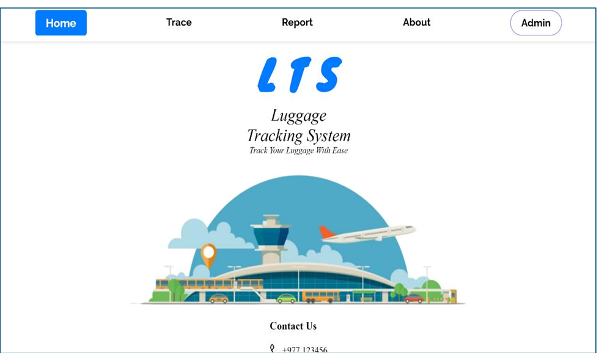

---

### Report Lost Luggage
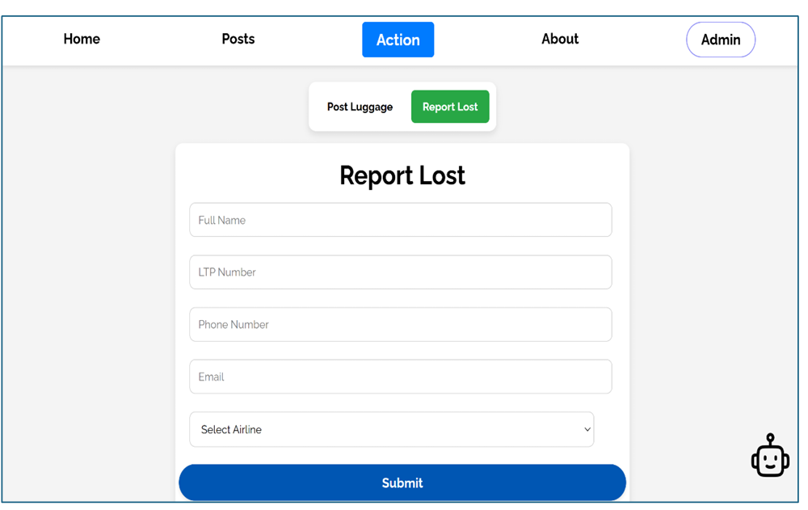

---

### Post Found Luggage
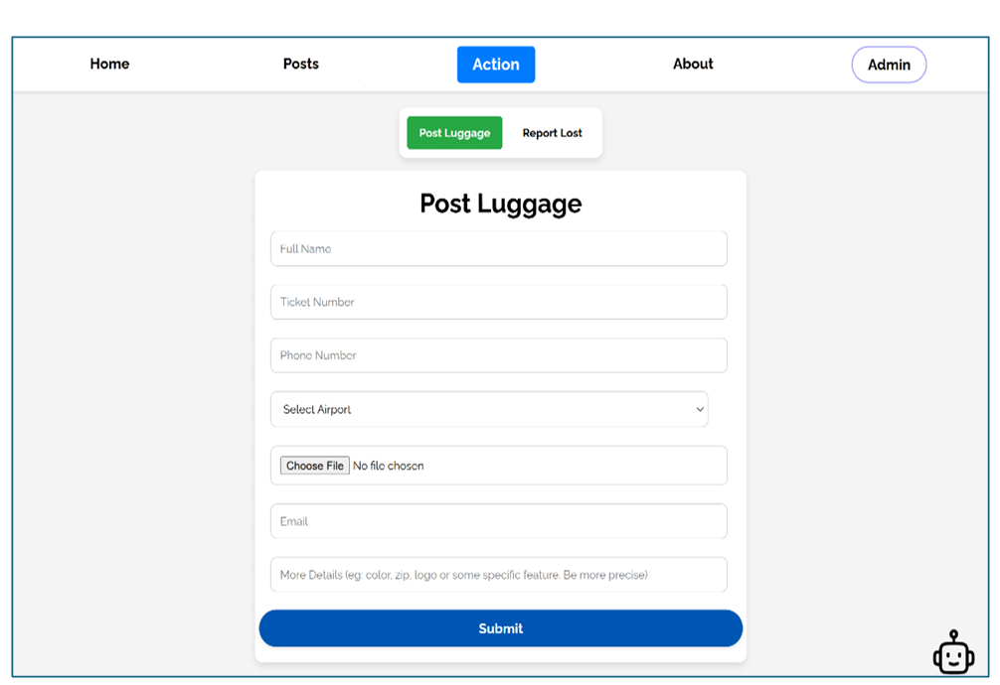

---

### Post Page
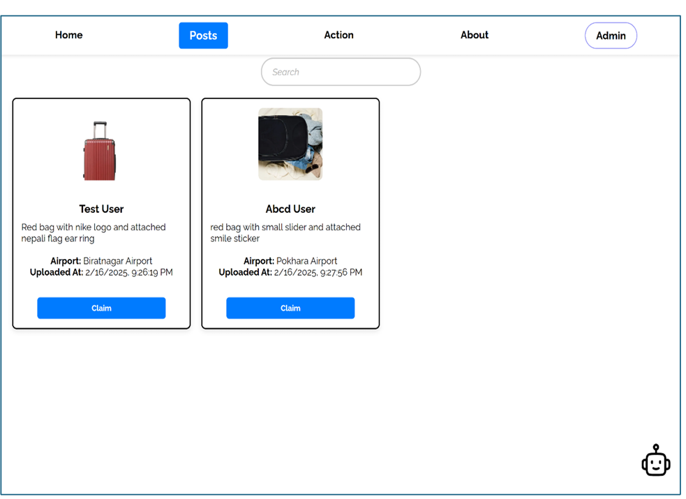

---

### Admin Login
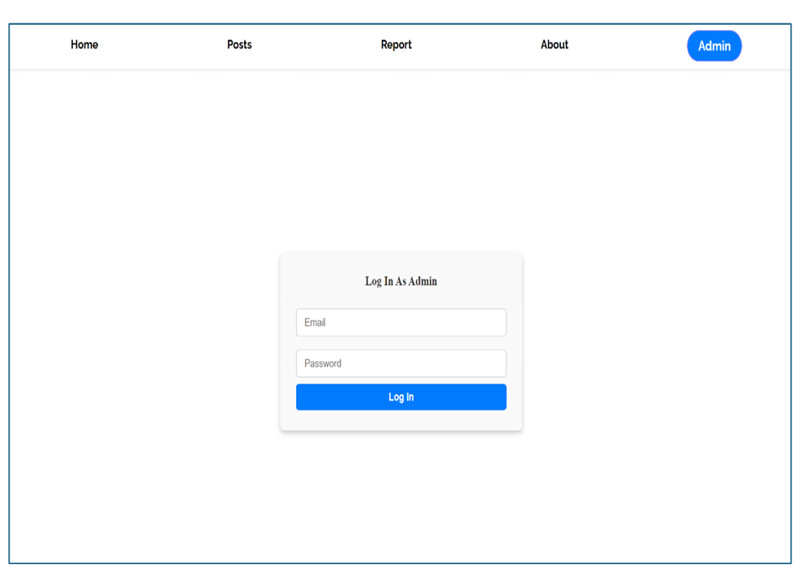

---

### Admin Dashboard Statistics

#### Stats View 1
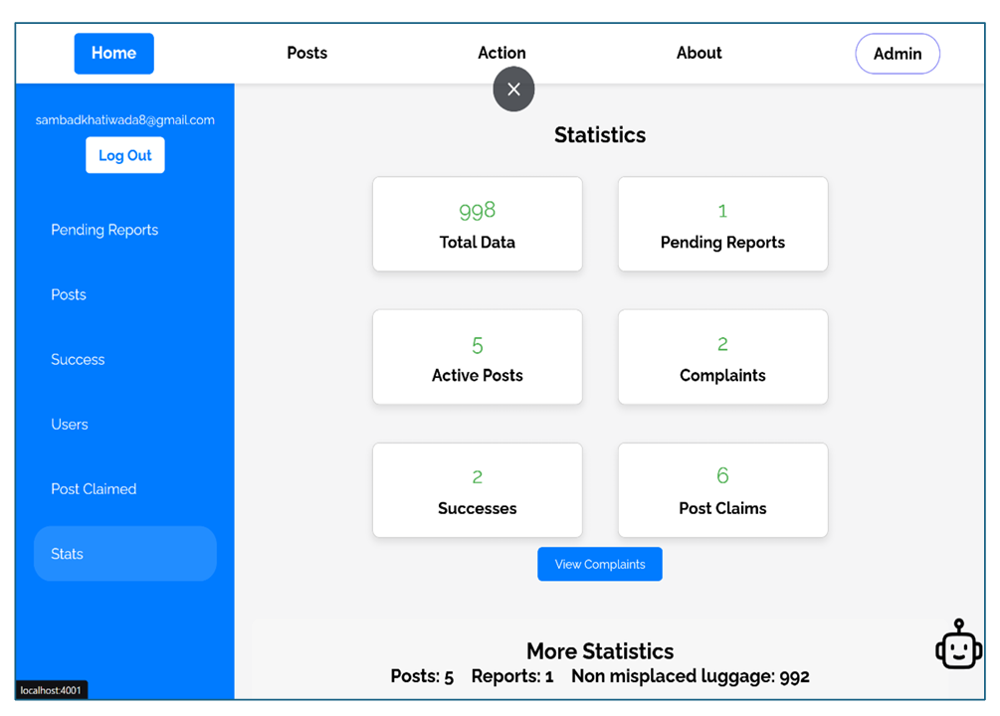

#### Stats View 2
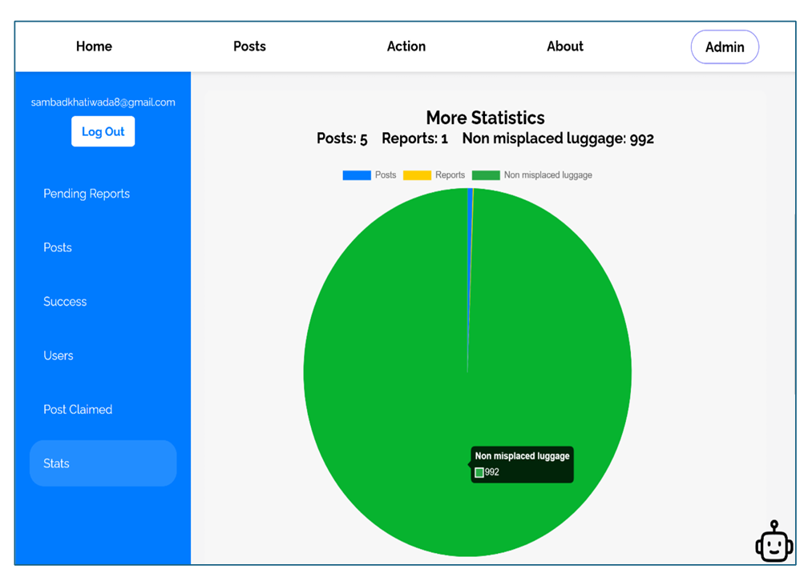

#### Stats View 3
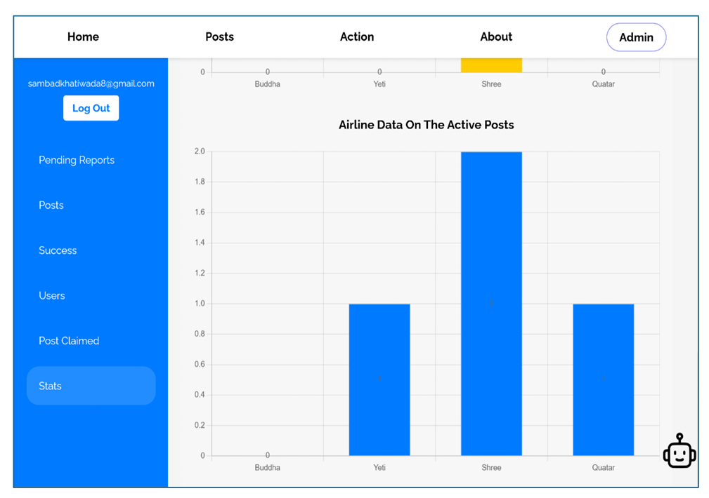

---

### Chatbot Interaction

#### Chat Example 1
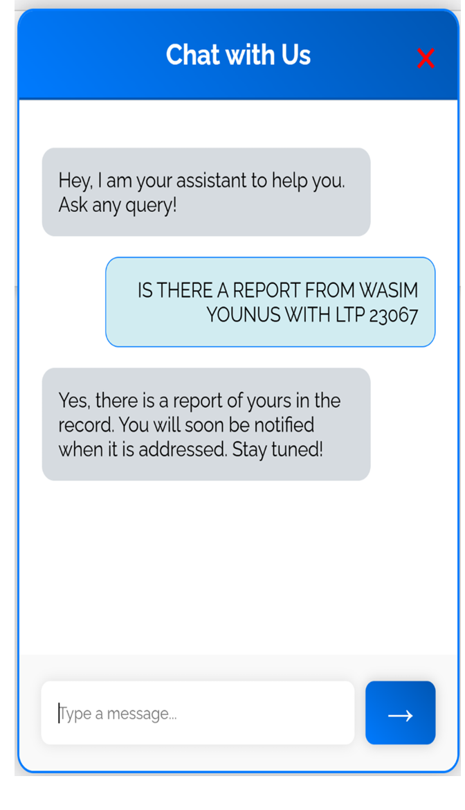

#### Chat Example 2
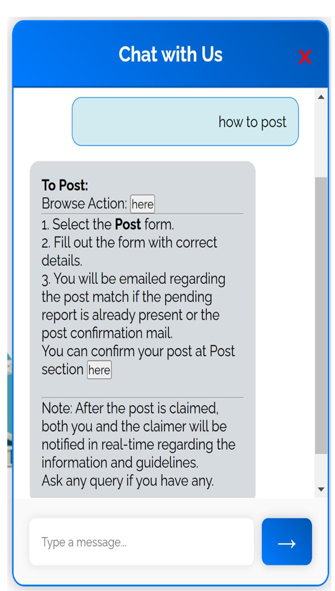

#### Chat Example 3
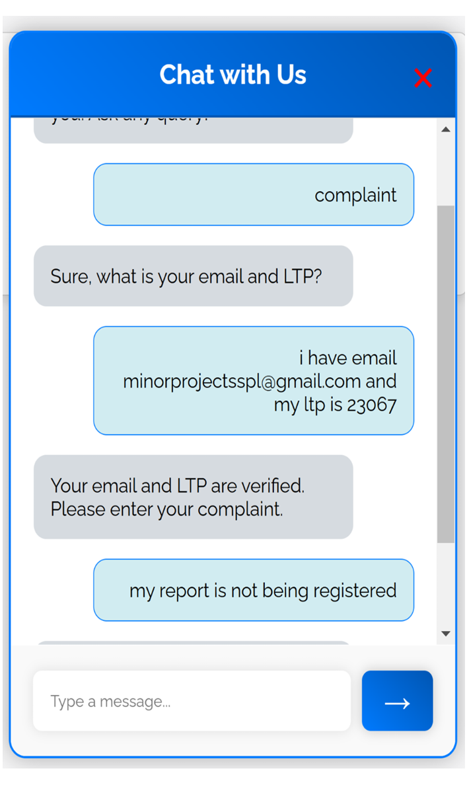

#### Chat Example 4
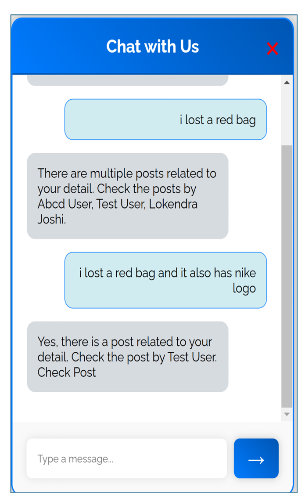

---

### NLP and Backend Processing

#### Regex Processing
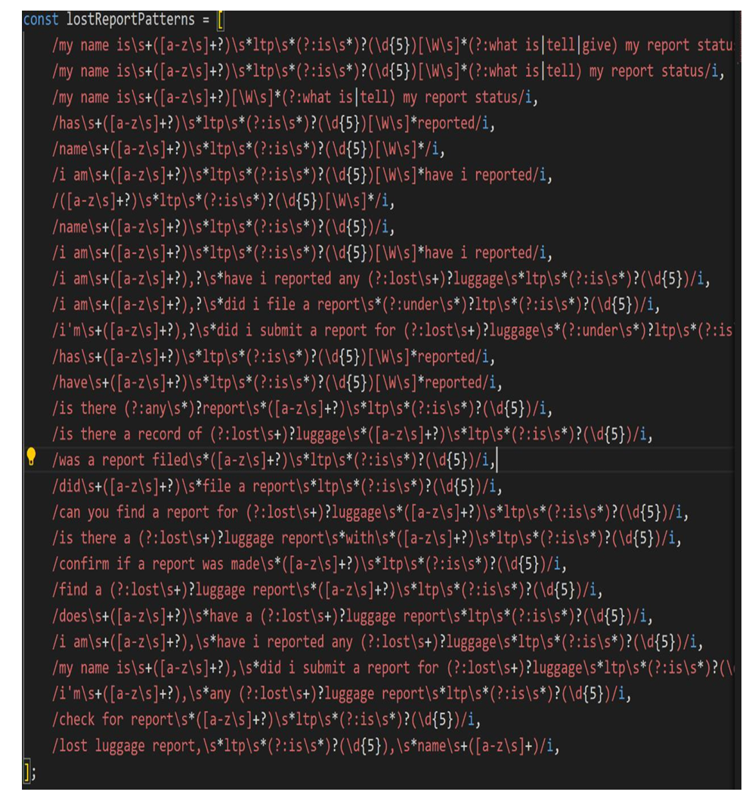

#### Email Service (Nodemailer)
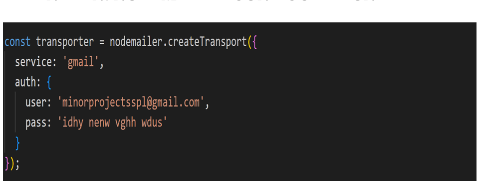

---

### Additional Screenshot

--------------------
## Contact
For queries contact : sambadkhatiwada939@gmail.com
